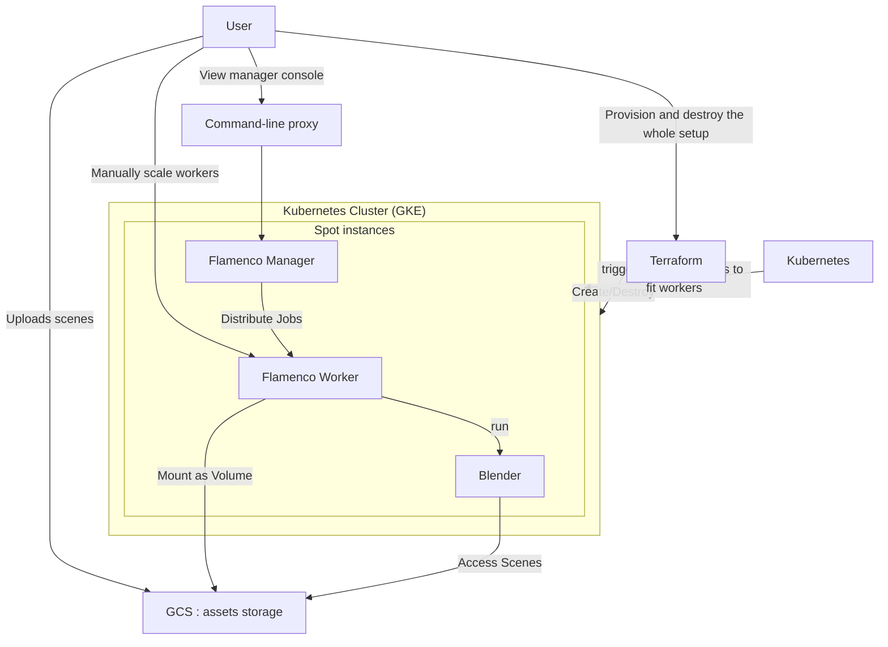

## About

This configuration enables running [Flamenco](https://flamenco.blender.org/) in the cloud, leveraging as much computing power as you can afford, instead of relying on physical computers.

The theoretical goals include:
* Having a large render farm at your disposal for a short period when time is critical.
* Utilizing the most affordable compute power available in the cloud, specifically spot instances.
* Scaling down to zero cost when there are no active jobs.

Although numerous cloud-based render services exist, they often come with exorbitant fees. This project aims to explore whether on-demand provisioning and an economical, disposable setup can offer a more cost-effective solution.

### Architecture

This might be too much technical jargon to those not familiar with clouds&infrastructure, but here is the main concept:

* Flamenco Worker and Flamenco Manager are packaged as Docker containers, bundled with Blender as well.
* Containers are executed in Kubernetes; this project setup uses Google's GKE for its superior per-project isolation and straightforward teardown process.
* Use spot instances for maximum cost savings.
* Use CPU rendering for simplicity of this proof-of-concept. GPU rendering not explored yet, but definitely a possibility, but comes with significant overhead for containers and cost/benefit ratio is unclear;
* Assets (e.g. Blender scenes) are uploaded and stored in a GCS (Google Cloud Storage) bucket, with containers mounting it as a filesystem volume.
* Users use a local HTTP proxy to communicate with the manager in the cloud.

This is a very crude experiment, making this public just to share with a few people.

## Usage

In it's current form, this is not a comprehensive checklist or an end-user journey, but more of an idea to test the setup.

* Create new GCP project
  * https://console.cloud.google.com/
  * Might need to boost quota for "n2d CPUs" right away, defaults are way to small for bursty workloads.
  * Configure credit card etc.
* Install prerequisites
  * https://taskfile.dev/ to use Taskfile targets 
  * Gcloud
  * Terraform
  * Helm
  * kubectl
* Deploy infrastructure
  * go to `deployment/infrastructure`
  * configure `terraform.tfvars` with project_id, and optional overrides for new infrastructure
  * `terraform init`
  * `terraform apply`
  * twist and push various knobs and buttons in GCP console until everything.
* Upload your blend files to assets repo via GCP console or `gsutil`
  * https://console.cloud.google.com/storage/browser/YOUR-BUCKET-NAME
* Access the manager and submit a render job - from main dir:
  * `task`: list all available tasks
  * `tak proxy`: open proxy to manager and inspect the setup
  *  `task workers-many`: scale to more workers. should trigger autoscaling of infrastructure, observe the process in GCP console and fix issues with more knobs and buttons;
  * `task debug-job`: submit a job to manager; proxy should be running in another terminal.
 * Destroy infrastructure:
   * Once you're done using things, destroy everything with `task tf-destroy`. If that fails, e.g. you lose your TF state or something - drop the whole project manually in GCP console.

## Notes

* manager can't run without detecting blender installation: should probably not care about it
* file-based configuration not as comfortable for some settings like configuring `shared_storage_path`: would be much easier to just feed into container as env var.
* downscaling workers did not register well on manager
* manager should run in a mode where unhealthy workers are just removed
* flamenco bug: selecting tasks in UI makes them jump around

## TODO:

* helm charts: review for hardcoded settings, like bucket name

* setup automatic worker autoscaling based on incoming work. might need manager tweaks for this
  * HPA on workers might be too indirect
  * explore custom KEDA scaler option
  * explore custom operator option

* IAC: automate SA creation
* IAC: automate bucket creation
* IAC: with terraform destroy, we'll drop bucket & service account, which probably stick around

* manager: do not run on spot. create small machine just for manager.
* worker memory: different jobs require different memory, might need a more dynamic way to set this.
* worker: if manager is unreachable, just die.
  * maybe possible via health probe?
* include ffmpeg
* script to reapply helm
* script to download Docker dependencies (blender, flamenco)

## Done:
* initial infrastructure automation to provision/destroy everything
* manager needs to start in ready-to-work setup without any introductory dialog.
