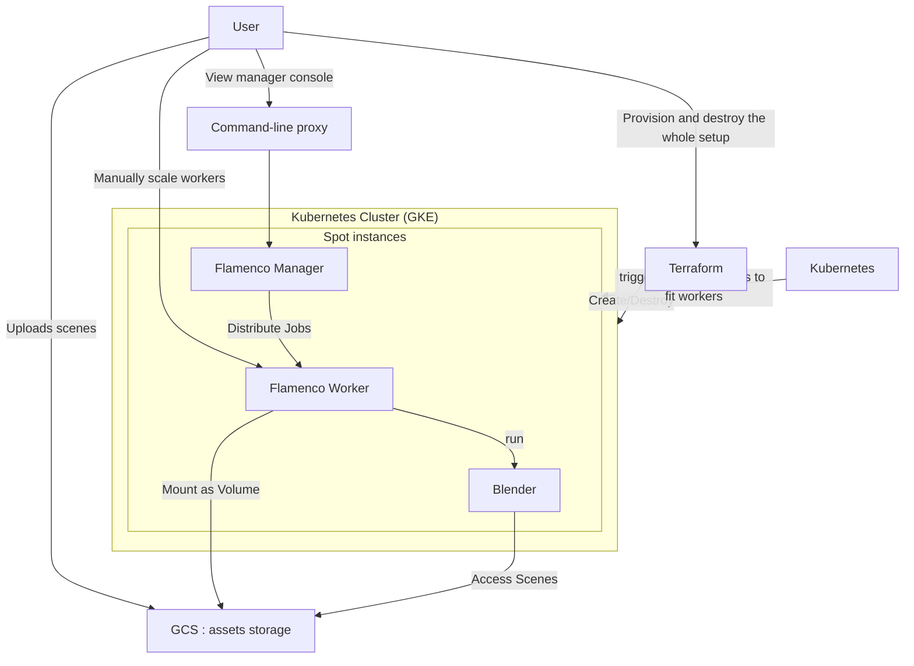

## About

This is a cloud configuration to run https://flamenco.blender.org/ with as many compute power as you can buy, as opposed to owning physical computers.

The theoretical goals would be:
* When time is of the essence, you'd prefer to just have a very big render farm for short period of time;
* Use cheapest compute power there is in the cloud - spot instances. 
* When no jobs are running, just scale down and don't pay a dime.

Of course, there are many cloud-based render services, but prices are outrageous - let's see if on-demand provisioning and cheap throaway setup can do better.

### Architecture

Probably mumbo-jumbo to 3d folks, but listing the main idea anyway:

* Create docker containers for flamenco-worker and flamenco-manager; bundle blender together with docker.
* Containers running in Kubernetes (chose Google GKE as google cloud provides best per-project isolation, easy to teardown)
* All worker nodes in Kubernetes configured as spots
* Blender scenes are stored in GCS (cloud storage) bucket; containers mount that as file system volume.
* using GCS (cloud storage) bucket for transfering scenes
* User uploads scenes to GCS bucket, and runs a local http proxy to reach manager on the cloud to view status.

This is a very crude experiment, making this public just to share with a few people.

## Notes

* manager can't run without detecting blender installation: should probably not care about it
* file-based configuration not as comfortable for some settings like configuring `shared_storage_path`: would be much easier to just feed into container as env var.
* downscaling workers did not register well on manager
* manager should run in a mode where unhealthy workers are just removed
* flamenco bug: selecting tasks in UI makes them jump around

## TODO:

* manager: do not run on spot. create small machine just for manager.
* worker memory: different jobs require different memory, might need a more dynamic way to set this.

* worker: if manager is unreachable, just die.
  * maybe possible via health probe?
* setup autoscaling! main goal of this exercise
* include ffmpeg
  
* IAC: automate SA creation
* IAC: automate bucket creation
* helm charts: review for hardcoded settings, like bucket name
* script to reapply helm
* script to download Docker dependencies (blender, flamenco)

## Done:
* initial infrastructure automation to provision/destroy everything
* manager needs to start in ready-to-work setup without any introductory dialog.
